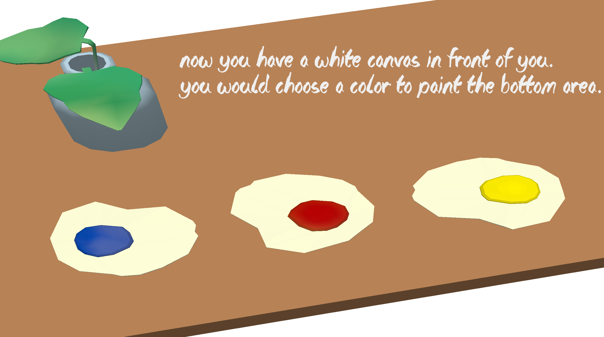

# Colorful Time

Author: Wei-Che(Wizard) Hsu

Design: Use various color to create your painting.

Text Drawing: 

Create buffer saving text and shape the text contents into glyphs by using harfbuzz API. Then, get positions of each char according to its glyph information. Use texture2d_program to draw triganles and to show the texture of each char. Text content is assigned and saved when initializing the PlayMode and is rendered at rumtime.

Screen Shot:

How To Play:

Use key R (Red), B (Blue), Y (Yellow) to choose the color you would like to use and then press SPACE to use the color to draw. You could choose multiple colors at once to create different colors! The color you choose would colors the background. Based on the colors you choose, you would create different styles of painting! Follow the guidance to decide which color to use. You would get the evaluation for the painting in the final!

Sources: 

Harfbuzz example: https://github.com/harfbuzz/harfbuzz-tutorial/blob/master/hello-harfbuzz-freetype.c \
2D texture program drawing example: https://github.com/GenBrg/MarryPrincess/blob/master/Texture2DProgram.cpp \
Font ttf: https://www.dafont.com/the-lost-paintings.font \
Mesh background: brunch.blend in the scene folder of game base code \
Background music: Trois Gymnopédies: Première Gymnopédie \
Brush sound effect: https://www.youtube.com/watch?v=WNGJMJ7FZfQ 2:00 - 2:10

This game was built with [NEST](NEST.md).

